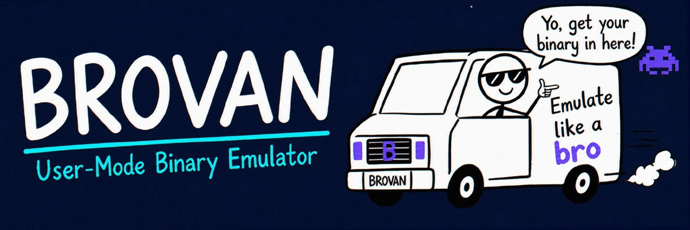

  
  
    
  
  
  
  
  
  

    <b>A user-mode x86_64 binary emulator for inspecting programs, tracing syscalls, and safely running untrusted software.</b>
  

  

## What is Brovan?

Brovan is an interactive x86_64 emulator that gives you full control over how programs execute. It can be used to reverse engineer binaries, trace API and system calls, capture network traffic, or run software in an isolated environment without executing it directly on your host CPU.

It is designed to support as much software as possible while remaining a safe, efficient, and high-performance option for running software across Windows and Linux. Brovan is still in early development, so it is not yet fully mature or reliable.

Supported backends:
* **Unicorn Engine** for cross-platform emulation
* **WHP** (Windows Hypervisor Platform) for hardware acceleration on Windows
* **KVM** (Kernel-based Virtual Machine) for hardware acceleration on Linux

## Core Features

<table width="100%">
  <tr>
    <td width="50%" valign="top" align="left">
      
<b>MULTI-FORMAT LOADING</b>

      
Load and execute binaries directly inside the emulator without host installation.

      <code>PE</code> &nbsp; <code>ELF</code> &nbsp; <code>Memory Dumps</code> &nbsp; <code>Raw Shellcode</code>
    </td>
    <td width="50%" valign="top" align="left">
      
<b>BROVVULK GRAPHICS LAYER</b>

      
Custom Vulkan translation subsystem handling DXVK calls and game rendering.

      <code>DXVK</code> &nbsp; <code>DirectX</code> &nbsp; <code>Vulkan Surface</code>
    </td>
  </tr>
  <tr>
    <td width="50%" valign="top" align="left">
      
<b>SYSCALL & API TRACING</b>

      
Inspect execution live to see what functions, DLLs, and kernel calls the program accesses.

      <code>Kernel Syscalls</code> &nbsp; <code>Symbol Resolving</code> &nbsp; <code>Loaded DLLs</code>
    </td>
    <td width="50%" valign="top" align="left">
      
<b>NETWORK DUMPING</b>

      
Intercept guest socket traffic and export network activity for payload analysis.

      <code>Socket Intercept</code> &nbsp; <code>PCAP Capture</code> &nbsp; <code>Traffic Analysis</code>
    </td>
  </tr>
</table>

## Previews & Demos

### Gaming & Graphics (Brovvulk)

Brovan can render guest graphical applications through its Brovvulk translation subsystem. Here is a sample game i had (Deltarune), but it can work on many other games:

<table width="100%">
  <tr>
    <td align="center" width="60%">
      
    </td>
    <td valign="top" width="40%" align="left">
      <h4>Deltarune Bring-up</h4>
      <ul>
        <li>Vulkan surface rendering via Brovvulk</li>
        <li>DPI-aware host window integration</li>
        <li>WHP acceleration for a smoother gaming experience</li>
      </ul>
    </td>
  </tr>
</table>

### Binary Execution & Tracing

<table width="100%">
  <tr>
    <td width="33%" align="center" valign="top">
      
       
      <b>Linux ELF on Windows</b>
       
      Running <code>fastfetch</code> cross-platform
    </td>
    <td width="33%" align="center" valign="top">
      
       
      <b>Syscall Tracing</b>
       
      Live logs of API calls and dynamic symbols
    </td>
    <td width="33%" align="center" valign="top">
      
       
      <b>Raw Binaries</b>
       
      Executing shellcode and memory dumps
    </td>
  </tr>
</table>

### Network Inspection

<table width="100%">
  <tr>
    <td width="50%" align="center" valign="top">
      
       
      <b>Network Capture</b>
       
      Intercepting guest socket reads and writes
    </td>
    <td width="50%" align="center" valign="top">
      
       
      <b>Traffic Analyzer</b>
       
      Viewing dumped PCAPs and payloads
    </td>
  </tr>
</table>

## Documentation & Wiki

Check out the [GitHub Wiki](https://github.com/AdvDebug/Brovan/wiki) for:
- [Building from source](https://github.com/AdvDebug/Brovan/wiki/Building-Brovan)
- Architecture details
- Command reference and usage guides
- [FAQ](https://github.com/AdvDebug/Brovan/blob/main/FAQ.md)

> [!WARNING]
> The [Releases](https://github.com/AdvDebug/Brovan/releases) page may not always have the latest changes.  
> For the most up-to-date version, **[build from source](https://github.com/AdvDebug/Brovan/wiki/Building-Brovan)** instead
> or use the latest build from <a href="https://github.com/AdvDebug/Brovan/actions">GitHub Actions</a>

# Credits
Thanks to <a href="https://github.com/icedland/iced">Iced library</a> for x86_64 disassembly and assembly.

Thanks to <a href="https://github.com/unicorn-engine/unicorn">Unicorn Engine</a> for the core emulator.

Thanks to my friend <a href="https://github.com/GittingHubbers">GittingHubbers</a> for help with the MLFQ Scheduler.

## Credits

- [Iced](https://github.com/icedland/iced) for x86_64 disassembly/assembly.
- [Unicorn Engine](https://github.com/unicorn-engine/unicorn) for core CPU emulation.
- Thanks to [GittingHubbers](https://github.com/GittingHubbers) for help with the MLFQ scheduler.

## License

GPL-2.0
